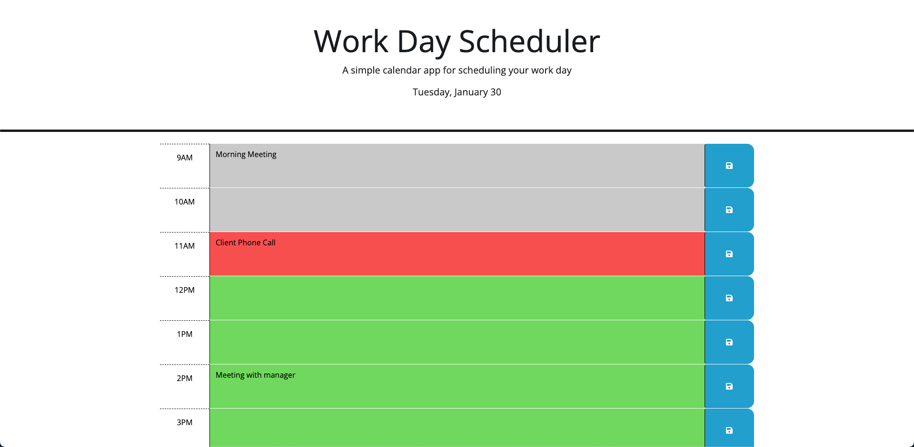

# UTA Coding Bootcamp Challenge 5 -- Work Day Schedule

## Description

This is my submission for the fifth challenge in the UTA/EdX Coding Bootcamp. The goal of this challenge was to create an interactive daily schedule with JavaScript.
The website presents you with a column of timeslots color-coded based on the current time and allows you to save custom messages in them.

<a href="https://njmeister.github.io/Challenge-4-JSQuiz/">Link</a>

## Installation

N/A

## Usage
The website marks the current hour with a red background, past hours with grey backgrounds, and future hours with green backgrounds. Each hour slot can be selected and typed into. The input can then be saved to local storage by clicking on the corresponding save button.

## Credits

The starter code is provided by the UTA/EdX boot camp.

## License

This repo uses an MIT License. See above for details.
